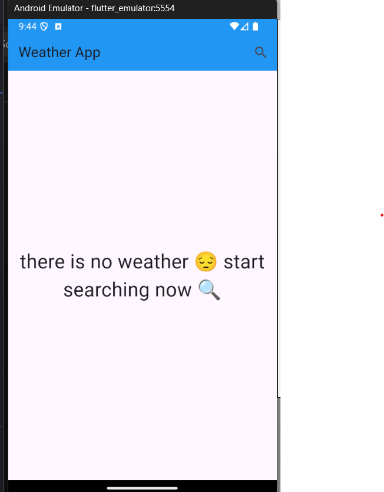
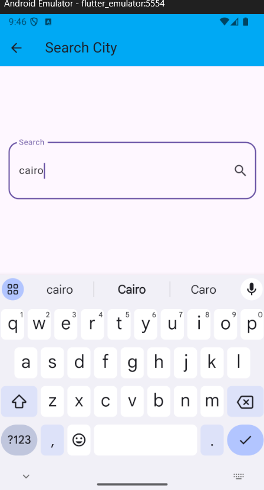
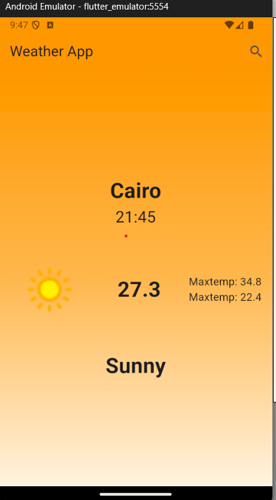

# Weather Flutter App

This is a simple Weather App built with Flutter. It provides real-time weather information for different locations by interacting with a weather API. The app is structured using the **BLoC** pattern and uses various Flutter packages to enhance functionality.

## Screenshots


<p align="center">
  
  
  
</p>


## Features

- **Real-time Weather Data**: Get up-to-date weather information for different cities.
- **Weather Details**: See temperature, humidity, wind speed, and more.
- **Multi-city Support**: Search for and view weather for multiple cities.
- **Formatted Date**: Weather data displays with formatted date strings.
- **Error Handling**: Graceful error handling for network issues or wrong city names.

## Packages Used

### 1. [dio](https://pub.dev/packages/dio)
Used to handle API requests. Dio makes it easier to make HTTP requests, parse the data, and handle network errors effectively.

### 2. [flutter_bloc](https://pub.dev/packages/flutter_bloc)
Used for implementing **Cubits** and managing the app's state efficiently using the **BLoC** (Business Logic Component) pattern. This helps in separating business logic from the UI and allows for a more scalable app architecture.

### 3. [intl](https://pub.dev/packages/intl)
This package is used to manipulate strings for formatting dates. The `intl` package helps convert raw date-time data from the weather API into human-readable formats.

## Widgets Used

- **Scaffold**: Provides the basic structure for the app, including the AppBar and body.
- **AppBar**: Displays the app's title and navigation options.
- **TextField**: Allows users to input a city name for searching weather information.
- **BlocBuilder**: Listens to Cubit/BLoC changes and rebuilds the UI accordingly based on the state.
- **Container**: Used for structuring the layout of the weather data.
- **Text**: Displays weather information such as temperature, city name, and weather conditions.
- **CircularProgressIndicator**: Shows a loading spinner when fetching data.
- **ErrorWidget**: Custom widget for displaying error messages when API calls fail.


### Prerequisites

- Flutter SDK version : 3.24.3
- An API key service website : https://www.weatherapi.com/

### Installation

1. Clone the repository:
   ```bash
   git clone https://github.com/TarekMohammedgg/weather_app.git

## About Me 
https://github.com/TarekMohammedgg/Tarek-Mohammed